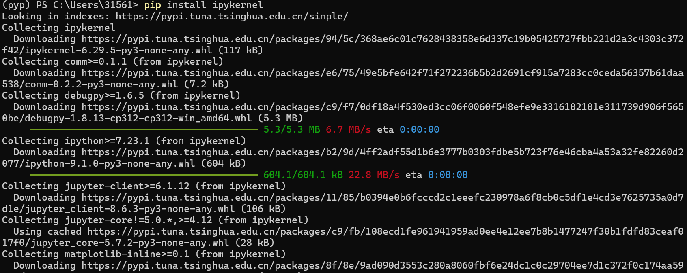
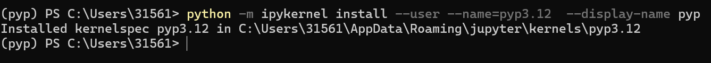
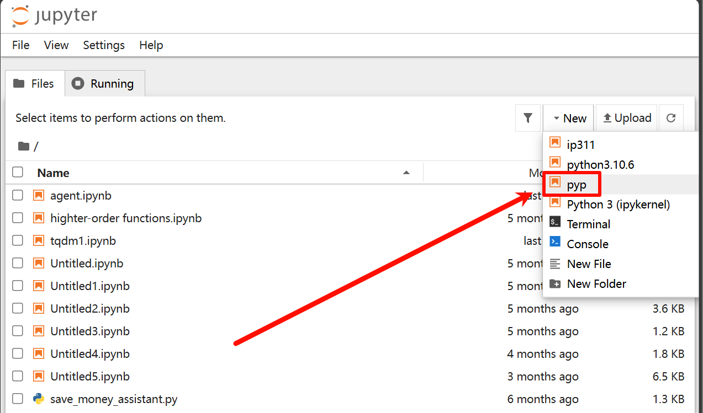

# NoteBook与内核的配置

## jupyter notebook 的介绍

...

## jupyter notebook 的内核配置

### 安装必要的库（mudule）

**首先进入需要配置内核的虚拟环境**
`conda activate pyp`

- ipykernel
    `pip install ipykernel`
    

### 添加内核

`python -m ipykernel install --user --name=pyp3.12  --display-name pyp`

**其中`--name`的参数指的是内核名字，`--display-name`的参数指的是notebook上显示的名字**

进入notebook查看内容

在终端中输入：`jupyter notebook`

可以发现内核已经成功建立了

